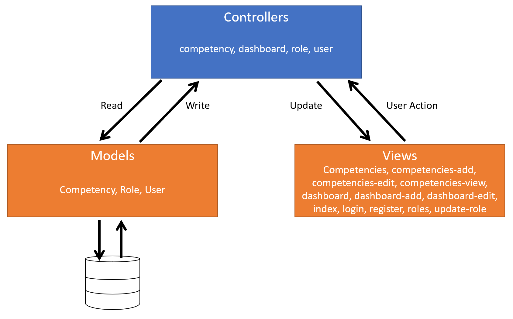
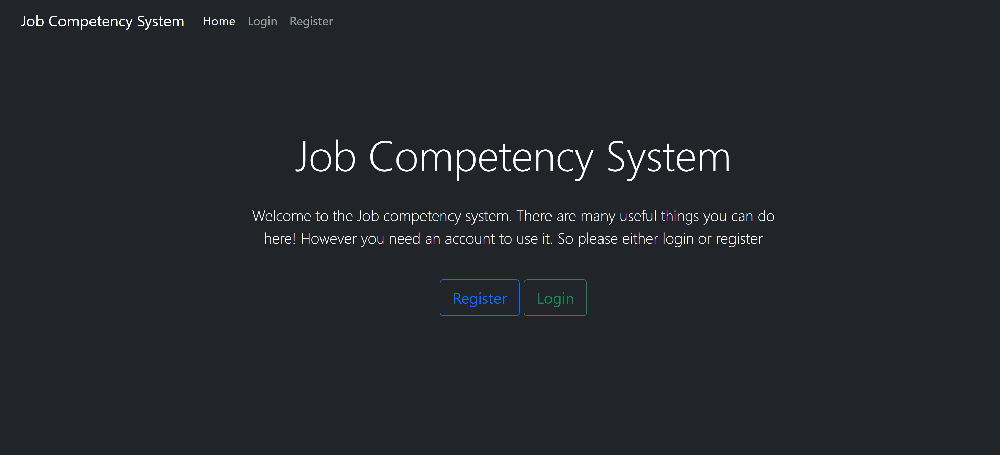
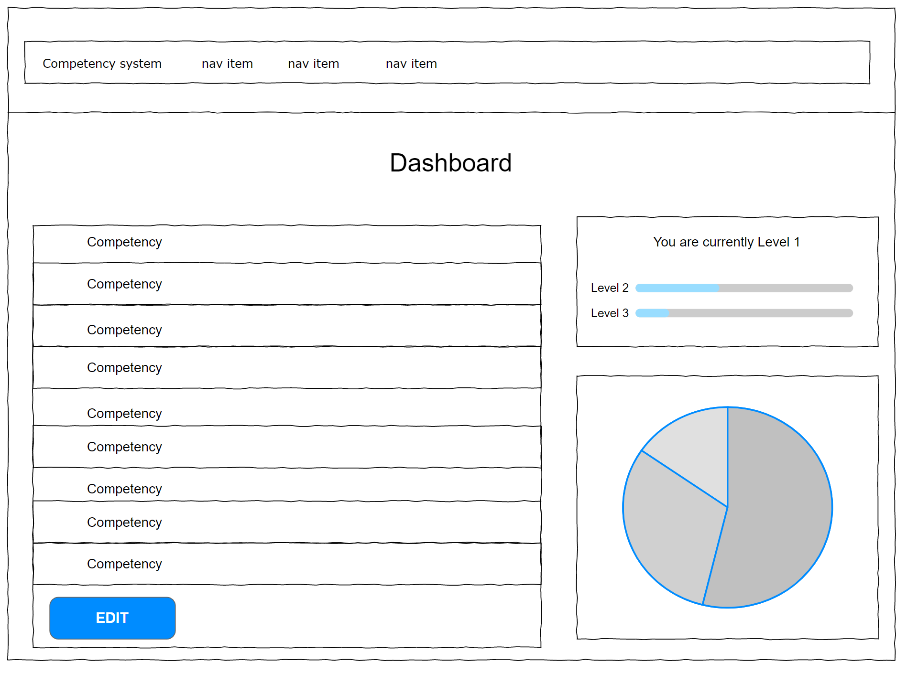
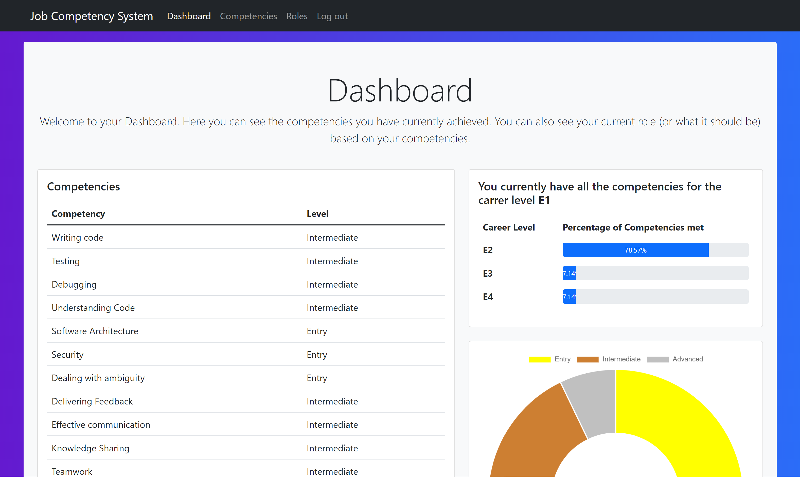
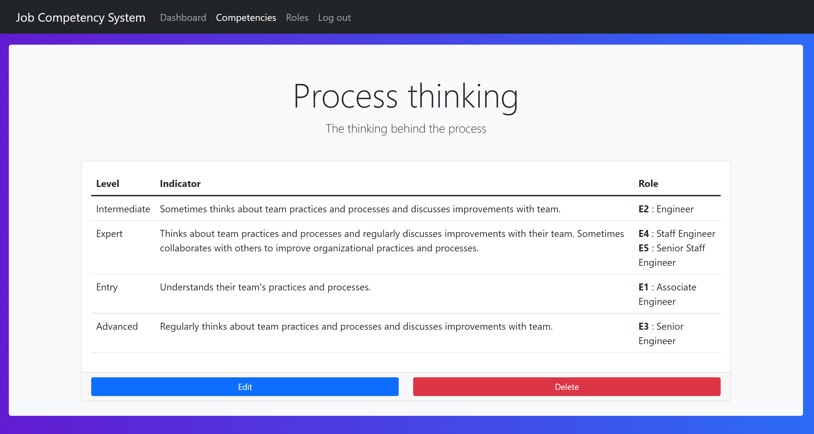
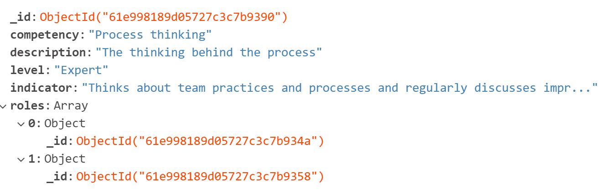
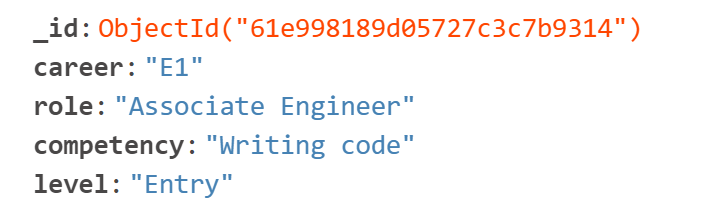
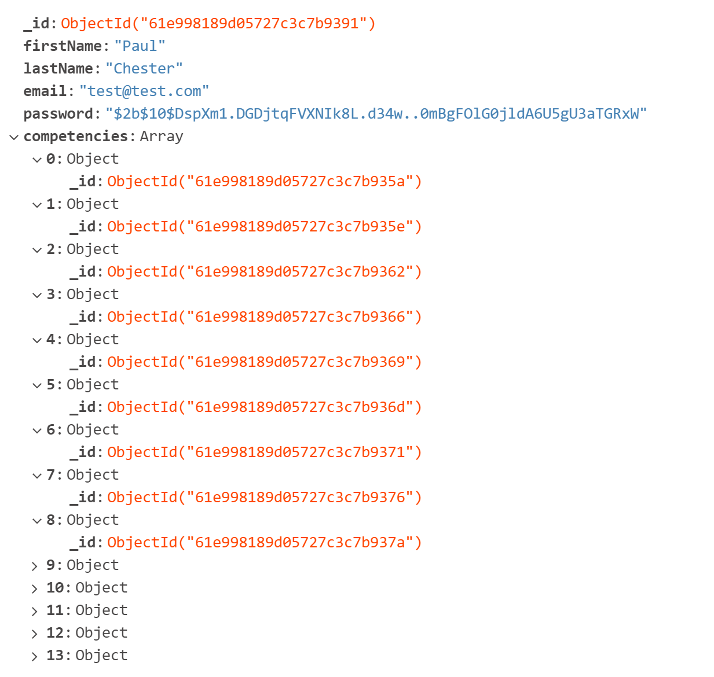

<h1> COM519_AE1 Report </h1>

Paul Chester

 
  
  
**Hosted application:** [Job Competency System (secret-gorge-16373.herokuapp.com)](https://secret-gorge-16373.herokuapp.com/)  
> You can register to the site or use the below login details to view an existing dashboard.
>> email: test@test.com  
>> password: password  
  
**GitHub Repo:** [4CHESP55/COM519_AE1 (github.com)](https://github.com/4CHESP55/COM519_AE1)

## Introduction

This project consisted of finding a problem to solve in my work or social life. I choose to focus on work and found that although there are career guides with competencies, it can take some time to work out what competencies you have and what roles they map to.  

My solution essentially puts the career guide into an interactive website, making it simple to track competencies achieved and find out what career level you are based on the competencies and what you need to do to reach the next level.  

The solution is to be used as a tool to prompt career discussions with managers as employees may not be at their correct career level and missing out on compensation/promotions. Being an apprentice, I am keen to keep progressing and the result of this project allows me to clearly see my progression path. 

This application isn’t required by my organisation however has the possibility to be used by them. The current data in the database is not directly related to my company due to the approval needed, however it does show the proof of concept.  

## System Overview

The system works with three different collections:
- users
- roles
- competencies

These are all stored in a MongoDB database. Being no-SQL each document in the competencies collection contains the document id's of the corresponding roles to link them. Similarly with the users collection. Each user has attributes you would expect from a user account but also the document id's of the competencies in which have have assigned themselves.

This assignment of document id's is initially done in loadDB.js when the data is loaded. There are aggregate functions to link the documents and insert them into the database. When modifying or adding new data from the web application the documents get updated by the controller which handles the querys.

Below shows the MVC stack of the application:

The controllers also use aggregation to return the desired set of data to display in the view to the end user.

### Key views and interfaces

The application requires a login before being able to see anything. This is due to the main function of the appliction being the user dashboard.

Below is the main page before logging in:

Once a user is logged in they are displayed with their dashboard. This returns all their assigned competencies along with an indicator of their career role along with a graphical chart representation of the overall levels of competencies. It was first designed as a wire-frame (see below).

This is the end result.

From here the user can remove or add competencies. This will remove or add the object id's of existing documents within the competencies collection to the user document within the users collection.

Another key view is the competencies view. From here competencies can be added, edited or removed. Below shows a competency being viewed:  

### Documents in collections

  
   
  

Above shows an example of a document from each collection. Starting with competencies then roles and finally users.

## Key Design Decisions
### Database Design
As stated in the system overview, there are three collections
- users
- roles
- competencies

A user can have many competencies which can have many roles associated with them. 

#### Users
The users collection has in each document firtname, lastname, email, hashed password, and an array of competency id's. The reason it's an array is because the number of competencies a single user has is variable.  

The users collection is used by the login and register views. When registering a new user there are no competencies linked to them and these will be added via the dashboard. The users collection is also used by the dashboard to obatain the competency id's which are then used to query the competencies collection to return the contents of the dashboard.

#### Roles
The roles collection contains in each document the career, role, competency, and level. There can be many documents with the same career and role as the competency and level can be different.  

This collection is used by the roles view but also the competency views to allow roles to be added to competencies where the role document id is pushed to the competency roles array.

#### Competencies
The competencies collection contains in each document the competency, description, level, indicator, and an array of role id's.  

This collection is used by the competency view as well as the dashboard for the reasons stated above.

### Security and Scalability

The application is secure in the way the passwords of accounts are saved. bcrypt is used to hash and salt the password so it is not stored in plain text. Before the password is saved to the database it is secured. When logging in the same bcrypt is used again to compare the hashed password in the database to the has of the password entered in the login page.  

User sessions have also been implemented with access to all pages other than home, login, and register restricted to logged in users. 

The solution is scaleable due to the rendering of the pages being based on the database queries. However the levels are also hard coded in some controllers to be able to perform comparisons for the pie chart and the competencies reached. However if these levels remain the same and the input data is the same as that of the json files that are read in by loadDB then this can be scaled really easily.

## Conclusion and Reflection

I believe my solution meets the assessment task. I have been able to demonstrate CRUD functionality with the web application and it also solves a problem in an effective way. I am happy with the outcome and the look and feel of the site as well as the functionality. If I had more time I would extend the users collection to contain manager details and the application to allow managers to see all their direct reports competencies. I would also lock down the site more, so a normal user can only use the dashboard with higher up admins controlling the competencies being added. Another Admin related function that I could implement would be file uploads to upload the data to the website which then fills the database, this would make the solution a lot more scaleable.  

There where two parts of this which were most difficult and that was arranging the data, since it wasn't from a standard source such as excel, and aggregation. The aggregation took the longest time to get the results I desired but luckily it all worked in the end. I think my expertise in bootstrap has also improved with this assessment and I am happy with the look of the site.
